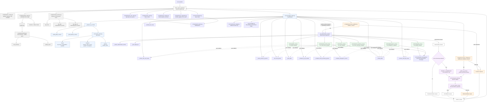

# ORI · Conversational BI Insight Engine

Mermaid architecture map for the current v0.8 preparation state.

```mermaid
flowchart TD

%% =========================================================
%% ORI · Conversational BI Insight Engine
%% Working architecture map · v0.8 preparation
%% =========================================================

A[User question] --> R[cli/run_report_openai.py<br/>Interactive Q&A loop]

R --> C1[config/dataset_config.yml<br/>Dataset, ingestion, KPI metadata]
R --> DI[src/pipeline/data_intake.py<br/>Load data from config]
DI --> DF[(DataFrame)]
DI --> SCHEMA[Schema + intake checks]

DF --> PROF[src/pipeline/profiling.py<br/>Stat summary + quality report]
PROF --> STAT[stat_summary]
PROF --> QR[quality_report]

R --> KSEL[src/pipeline/kpi_selector.py<br/>Human-in-the-loop KPI focus]
KSEL --> KFOCUS[kpi_focus]
KSEL --> KDATA[kpi_data<br/>computable focus KPIs]
KSEL --> KALL[kpi_data_all<br/>observable KPI universe]

R --> ENGINE[src/core/insight_engine.py<br/>InsightEngine]

ENGINE --> PREP[_prepare_qa_context]
PREP --> GLOBAL[_build_global_context]
PREP --> TABCTX[_build_tabular_context]
PREP --> BICTX[src/core/bi_context.py<br/>BIContext]

BICTX --> SCOPE[Scope<br/>kpi_focus / computable / available]
BICTX --> ANALYTICS[Analytics<br/>numeric_stats / trend / growth / correlations]
BICTX --> QUALITY[Quality<br/>quality_report]

ENGINE --> CONTRACT[src/pipeline/contract_validator.py<br/>validate_contract]
CONTRACT -->|ASK / REFUSE| CONTRACT_OUT[Contract response]
CONTRACT -->|OK| DET[_try_deterministic_answer<br/>deterministic dispatcher]

ENGINE -. quality requests bypass quantitative contract .-> DET

DET --> INTENTS[_detect_deterministic_intents]
DET --> PICK[_pick_target_kpi]

DET --> QT[src/tools/quality_tool.py<br/>run_quality_analysis]
DET --> MT[src/tools/multi_trend_tool.py<br/>run_multi_trend_analysis]
DET --> DT[src/tools/divergence_tool.py<br/>run_divergence_analysis]
DET --> YOY[src/tools/yoy_tool.py<br/>run_yoy_analysis]
DET --> TS[src/tools/trend_summary_tool.py<br/>run_trend_summary_analysis]
DET --> TT[src/tools/table_tool.py<br/>run_table_analysis]

ENGINE --> H1[_extract_time_and_value]
ENGINE --> H2[_series_points_by_period]
ENGINE --> H3[_min_max_period]
ENGINE --> H4[_pop_signs]
ENGINE --> H5[_compute_yoy_pct_table]
ENGINE --> H6[_compute_trend_summary_generic]
ENGINE --> H7[_compute_divergence_zscore]
ENGINE --> H8[_format_table]
ENGINE --> H9[_resolve_multi_kpi_scope]
ENGINE --> H10[_classify_kpi_scope]

TT -. uses callback .-> H1
TT -. uses callback .-> H8

YOY -. uses callback .-> H5
YOY -. uses callback .-> H8

TS -. uses callback .-> H6
TS -. uses callback .-> H8

DT -. uses callback .-> H7
DT -. uses callback .-> H8
DT -. uses callback .-> H9

MT -. uses callback .-> H1
MT -. uses callback .-> H2
MT -. uses callback .-> H3
MT -. uses callback .-> H4
MT -. uses callback .-> H8
MT -. uses callback .-> H9

QT --> SYSMSG[src/core/system_messages.py<br/>Canonical deterministic messages]
DT --> SYSMSG
MT --> SYSMSG

DET -->|deterministic answer| DETOUT[Deterministic answer]

DETOUT --> COMMENT{LLM commentary allowed?}
COMMENT -->|yes| PROMPTC[PROMPT_COMMENTARY<br/>LLM narration only]
PROMPTC --> LLM[src/core/openai_client.py<br/>OpenAI adapter]
COMMENT -->|no| FINALDET[Final deterministic answer]

ENGINE --> FALLBACK_CHECK[src/pipeline/contract_validator.py<br/>validate_llm_fallback_contract]
FALLBACK_CHECK -->|REFUSE| CONTRACT_OUT
FALLBACK_CHECK -->|OK| PROMPTQA[_build_qa_prompt / _build_qa_prompt_tabular]
PROMPTQA --> LLM

LLM --> GUARD[_no_new_metrics_check<br/>No New Metrics guardrail]
GUARD -->|offenders| BLOCK[Blocked fallback output]
GUARD -->|clean| LLMOUT[LLM fallback answer]

FINALDET --> FINAL[_finalize_answer]
LLMOUT --> FINAL
BLOCK --> FINAL
CONTRACT_OUT --> FINAL

FINAL --> R

R --> QAINTENT[src/pipeline/qa_intent.py<br/>detect_intent]
R --> QASUM[src/pipeline/qa_analysis.py<br/>build_analysis_summary]
R --> QASUG[src/pipeline/qa_suggestion.py<br/>should_suggest_mini_report]
R --> QAMINI[src/pipeline/qa_mini_report.py<br/>generate_mini_report]
QAMINI --> PDF[src/report/pdf_reporter.py<br/>PDFReporter]

R --> VIZ[src/viz/visualization.py<br/>base charts]
VIZ --> PDF

ENGINE --> DLOG[src/core/decision_logger.py<br/>JSONL decision log]
ENGINE --> LOG[src/core/logger.py<br/>ORI_DEBUG 0/1 technical logger]

classDef runner fill:#f7f7f7,stroke:#555,stroke-width:1px;
classDef core fill:#eef5ff,stroke:#336699,stroke-width:1px;
classDef tool fill:#eefaf0,stroke:#3a7a3a,stroke-width:1px;
classDef contract fill:#fff4e6,stroke:#cc7a00,stroke-width:1px;
classDef llm fill:#f8eefe,stroke:#8a4caf,stroke-width:1px;
classDef data fill:#f2f2f2,stroke:#777,stroke-width:1px;
classDef output fill:#fff,stroke:#222,stroke-width:1px;

class R runner;
class ENGINE,PREP,GLOBAL,TABCTX,BICTX,SCOPE,ANALYTICS,QUALITY core;
class QT,MT,DT,YOY,TS,TT tool;
class CONTRACT,FALLBACK_CHECK,CONTRACT_OUT,BLOCK contract;
class LLM,PROMPTC,PROMPTQA,COMMENT,GUARD llm;
class C1,DI,DF,SCHEMA,PROF,STAT,QR,KSEL,KFOCUS,KDATA,KALL data;
class FINAL,FINALDET,LLMOUT,DETOUT output;

```
